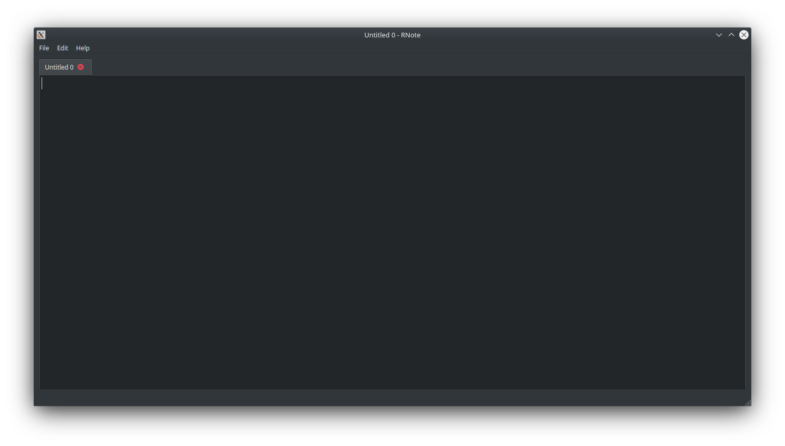

# RNote
## A minimalistic notepad with tabs designed with C++

### RNote in action

    

### Features

 - Basic notepad features (New,Open,Save etc.)
 - Multiple tabs

### Technologies used

- Qt
- CMake

### Requirements

- CMake (> 3.14)
- Qt framework (pref 5.9.9)

### How to install
- Will deploy it soon

### Developed by
[Rushikesh Kundkar](https://github.com/RRkundkar777)  

### Status
